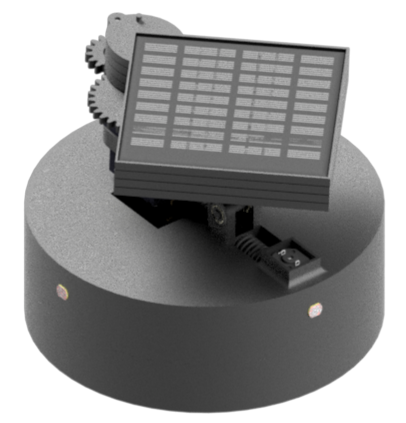

# Suntracker – Solar Tracker Powerbank with MPPT

## Description

Suntracker is a prototype solar tracking powerbank designed as a mechatronic student project. The device combines a small photovoltaic system, motorized panel positioning, battery charging and a simplified MPPT control concept.

The main goal of the project was to design a compact autonomous device that can improve solar energy harvesting by changing the position of the panel according to light conditions. The project includes mechanical design, custom PCB design, embedded software, simulations, documentation and basic validation calculations.

## Features

* Dual-axis solar panel positioning concept
* Automatic search for the optimal panel position
* Light intensity sensing using photoresistors
* Panel voltage and current measurement
* MPPT-inspired control using a digitally adjustable charging current
* Li-Ion battery charging and protection circuitry
* Motor and servo power switching
* Low-power sleep mode support
* Custom PCB design
* 3D printed mechanical structure

## Challenges

Main development challenges:

* combining solar tracking with powerbank functionality,
* estimating the energy balance of a small photovoltaic system,
* limiting power consumption during idle operation,
* switching power rails for motors and servos,
* designing a compact mechanical structure,
* integrating the PCB with the mechanical model,
* implementing a simplified MPPT control method,
* validating motor torque and energy assumptions without a full physical prototype.

## Validation

The project includes validation of the key design assumptions. The mechanical validation checks whether the selected motors should be able to move the designed mechanism. The energy validation estimates whether the device can be self-sufficient under favorable lighting conditions.

The calculations are approximate and do not include all real losses in the electrical system. A physical prototype would be required for final verification of tracking efficiency, energy balance and long-term reliability.

## Current status

The project is prepared as a complete design and documentation package. It includes firmware, PCB files, mechanical files, simulations, BOM and project documentation.

The next step would be building a physical prototype, measuring real energy production and verifying the tracking algorithm under outdoor lighting conditions.
